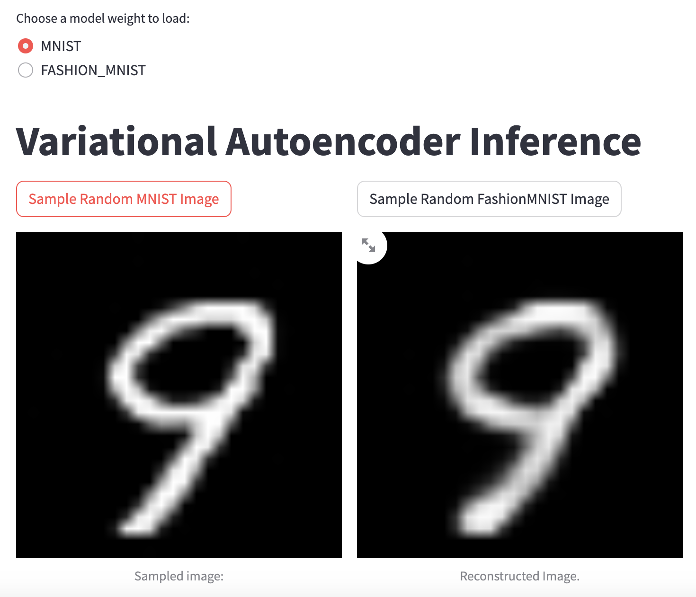
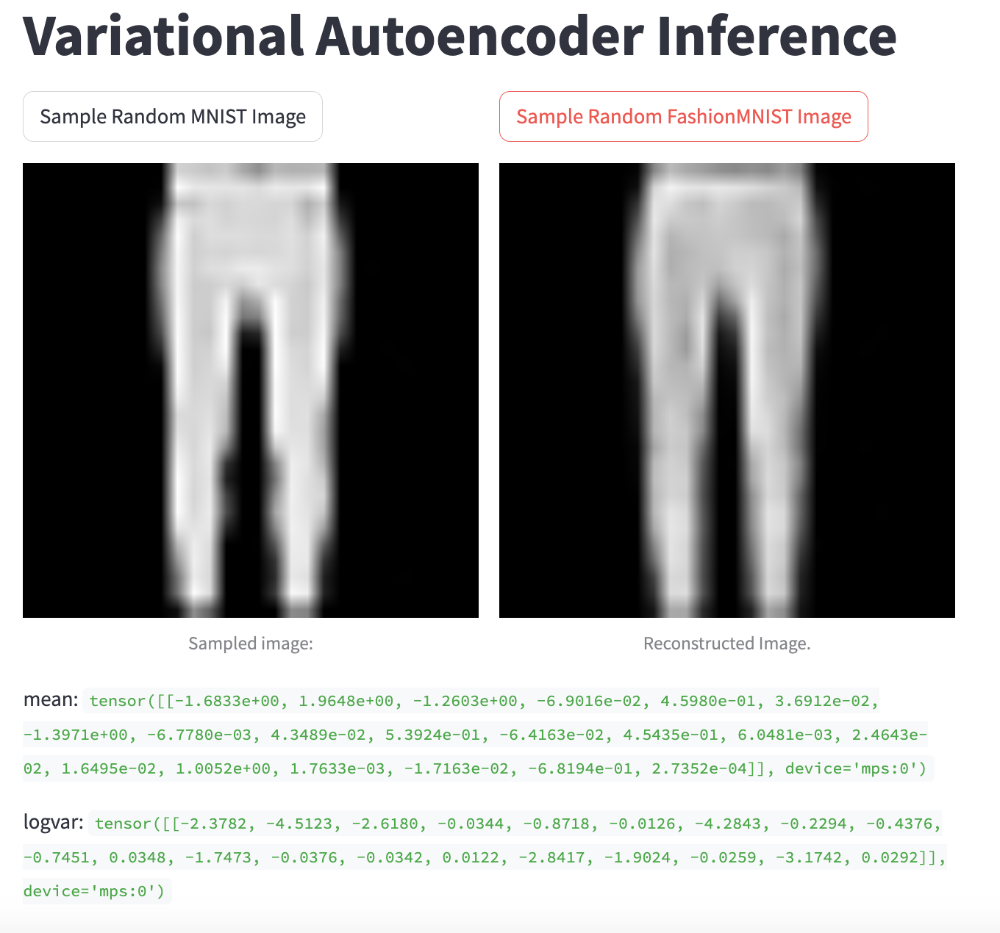
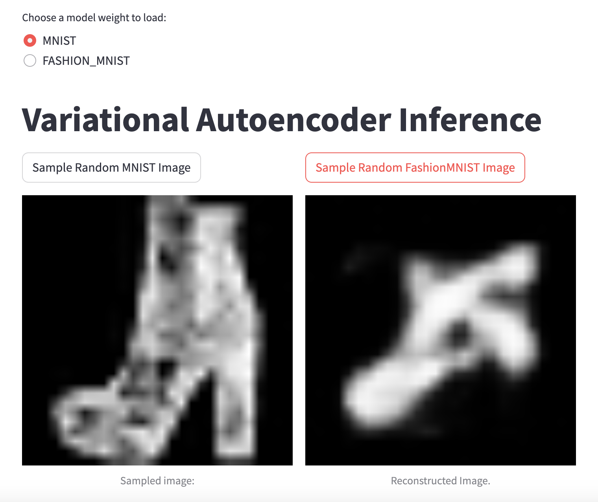
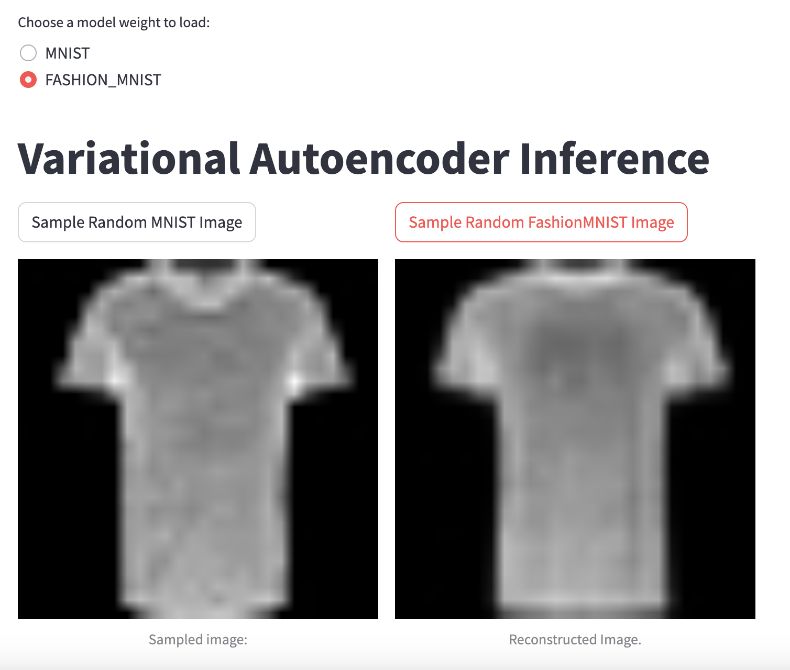

# Implementation for various vision algorithms

# VAE
Demonstrates how VAE works by training a model on MNIST and FASHION MNIST datasets.
A streamlit ui is available using `streamlit run ui.py`.
The UI allows you to load weights trained using both MNIST and FASHION MNIST datasets.
You can see the results are quite good when the sampled image is inside the same distribution that was used for training as expected.
When the input is out of distribution the results are not good, but the model is still trying to find something that resembles the original.
The reconstruction is done using only the mean and logvar tensors in the photo which shows the compression power of variational autoencoders.

